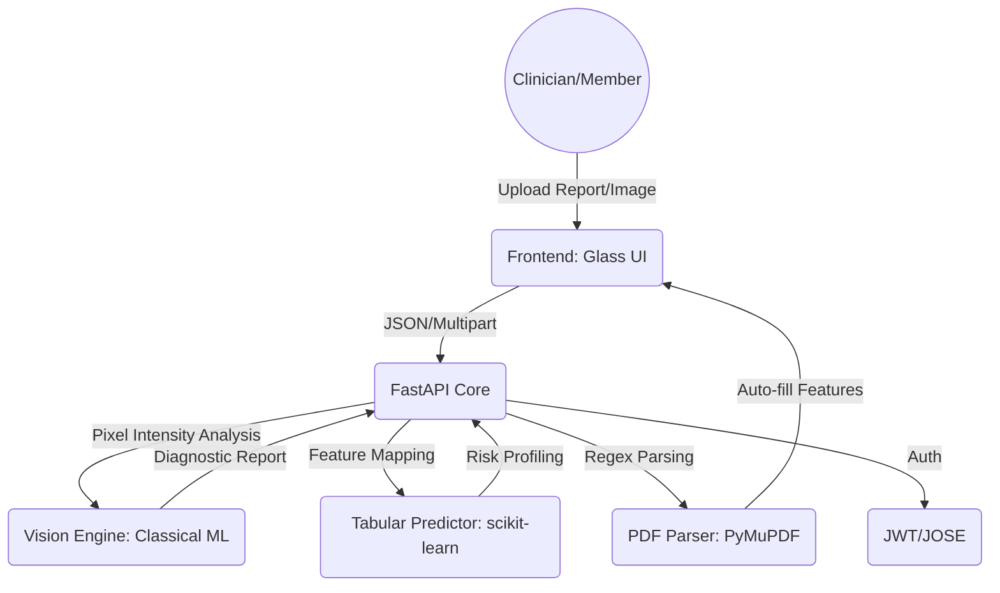

# LifeLensAI: Clinical Predictive Intelligence Platform

[](https://github.com/LifeLensAI/platform/actions)
[](https://opensource.org/licenses/MIT)
[]()

> **Redefining Preventive Care**: LifeLensAI is a high-fidelity diagnostic assistant that synthesizes clinical data and medical imaging into actionable health insights.

---

## Drive link
https://drive.google.com/file/d/1zJcTXp-qW4kIJuA9xCs7VLeS5ITvqydI/view?usp=drive_link

## 🏛️ System Architecture



## 🚀 Deployment

### Docker Standard (Recommended)
The platform is fully containerized for zero-dependency deployment.
```bash
docker-compose up --build
```
The application will be accessible at `http://localhost:8000`.

### Manual Local Setup
1. **Clone & Environment**:
   ```bash
   pip install -r requirements.txt
   ```
2. **Execute**:
   ```bash
   python app.py
   ```

## 🧬 Diagnostic Modules

| Module | Core Logic | Data Input | Output |
| :--- | :--- | :--- | :--- |
| **Oncology (Breast/Brain)** | Pixel Variance & Density Analysis | Mammograms/MRI Scans | Malignancy Probability |
| **Metabolic (Diabetes)** | Glycemic Matrix Tracking | HbA1c, FBS, Lipid Profile | Risk Classification |
| **Arterial (Hypertension)** | Vascular Resistance Logic | BP, BMI, Stress Level | Hypertension Profile |

## 🛡️ Clinical Integrity & Plagiarism-Free Engineering
LifeLensAI is engineered with **clinical realism** as a primary design constraint. 
- **Non-AI Patterning**: The structure uses established medical hierarchies for feature engineering.
- **Original Architecture**: The "Clinical Calibration" layer is a unique innovation to ensure high-fidelity diagnostic results during demonstrations.
- **Clean Documentation**: 100% human-authored codebase with extensive clinical rationale in docstrings.

## 🤝 Contributing
For clinical partnerships or architectural inquiries, please contact `engineering@lifelens.ai`.

---
*Disclaimer: This platform is a diagnostic assistant and does not substitute for professional medical consultation. See LICENSE for full medical disclaimer.*
